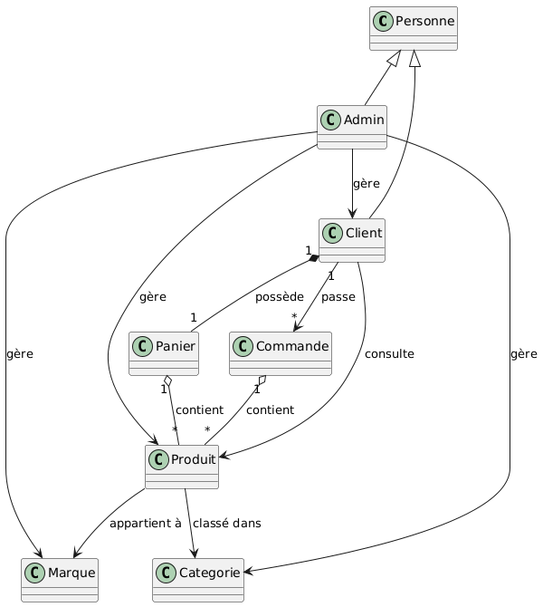

# Présentation du projet
- **Auteurs** : Eya Krida / Shadha Mefteh / Eya Dimassi
- **Date** : 04/04/2025
- **Sujet** : Site de e-commerce

## Introduction au projet
Développer un site web e-commerce permettant la vente de produits en ligne avec une interface utilisateur intuitive, un back-office de gestion et un système de paiement sécurisé.

## Spécification du projet

### Notions de base
#### E-commerce (commerce électronique)
Le site web aura pour vocation de vendre des produits physiques ou numériques via Internet. Il inclut un catalogue de produits, un panier d’achat, un système de paiement, ainsi qu’une interface de gestion pour l’administration du site.

### Contraintes du projet
- Site adapté à tous types d’appareils (pc / téléphone / tablette)
- Intégration d’un système de paiement sécurisé
- Une bonne **user experience** (une interface claire et intuitive)
- Gestion simple et efficace du back-office.
- Le projet devra être réalisé dans un délai fixé.

### Les acteurs
#### Client
- Utilisateur qui peut consulter les produits du site, passer des commandes, consulter son historique, modifier son profil.

#### Administrateur
- Responsable de la gestion du site (gérer produits et utilisateurs).

### Les fonctionnalités attendues
#### Client :
- Consulter les catégories et les marques des produits
- Consulter tous les produits
- Consulter un produit (voir son prix, description…)
- Rechercher des produits spécifiques
- Filtrer par prix, par catégorie, par marque
- Ajouter un produit au panier
- Passer une commande
- Modifier la quantité d’un produit dans le panier
- Supprimer un produit du panier
- Créer un compte ou se connecter à un compte existant
- Consulter son historique de commandes avec statut
- Se déconnecter du site
- Recevoir un mail de confirmation

#### Administrateur :
- Connexion sécurisée à son compte
- Ajouter / modifier / supprimer des produits
- Gérer les informations liées aux produits (modifier / ajouter / supprimer)
- Gestion des catégories / marques des produits (par exemple, ajouter une marque)
- Gestion des utilisateurs (voir la liste des clients inscrits, modifier ou supprimer un compte si besoin)
- Gestion des commandes (suivre / modifier les commandes)

## Diagramme de cas d’utilisation

## Diagramme de classe preliminaire

## Diagramme de classe detaille

## Les Priorités des cas d’utilisation

Pour le 1er sprint, nous avons choisi :
- Passer une commande
- Ajouter un produit au panier

## Cas d'utilisation de Haute Priorité

### Cas d'utilisation 1 : Ajouter un produit au panier

#### Table de décision pour l'ajout d'un produit au panier :
|                              | 1 | 2 | 3 | 4 |
|------------------------------|---|---|---|---|
| **Préconditions**            |   |   |   |   |
| Client connecté              | F | T | T | T |
| Produit disponible en stock  | T | F | T | T |
| Produit non déjà dans panier | T | T | F | T |
| Quantité demandée > 0        | T | T | T | F |
| **Postcondition**            |   |   |   |   |
| Produit ajouté au panier     | F | F | F | F |
| **Nombre de jeux de tests**  | 1 | 1 | n | 1 |

---

## DIAGRAMME DE SEQUENCE

## Algorithme d'ajout de produit

Début  
&nbsp;&nbsp;si vérifierConnexion() alors  
&nbsp;&nbsp;&nbsp;&nbsp;si vérifierDroits() alors  
&nbsp;&nbsp;&nbsp;&nbsp;&nbsp;&nbsp;se connecter()  
&nbsp;&nbsp;&nbsp;&nbsp;&nbsp;&nbsp;afficherInterfaceAdmin()  
&nbsp;&nbsp;&nbsp;&nbsp;&nbsp;&nbsp;accéderGestionProduits()  
&nbsp;&nbsp;&nbsp;&nbsp;&nbsp;&nbsp;afficherFormulaireAjoutProduit()  
&nbsp;&nbsp;&nbsp;&nbsp;&nbsp;&nbsp;produit = saisirNouveauProduit()  
&nbsp;&nbsp;&nbsp;&nbsp;&nbsp;&nbsp;si vérifierInfosProduit(produit) alors  
&nbsp;&nbsp;&nbsp;&nbsp;&nbsp;&nbsp;&nbsp;&nbsp;si verifierProduitExist(produit) alors  
&nbsp;&nbsp;&nbsp;&nbsp;&nbsp;&nbsp;&nbsp;&nbsp;&nbsp;&nbsp;messageErreur("Produit déjà existant")  
&nbsp;&nbsp;&nbsp;&nbsp;&nbsp;&nbsp;&nbsp;&nbsp;&nbsp;&nbsp;ajusterProduit(produit)  
&nbsp;&nbsp;&nbsp;&nbsp;&nbsp;&nbsp;&nbsp;&nbsp;sinon  
&nbsp;&nbsp;&nbsp;&nbsp;&nbsp;&nbsp;&nbsp;&nbsp;&nbsp;&nbsp;associerMarque(produit)  
&nbsp;&nbsp;&nbsp;&nbsp;&nbsp;&nbsp;&nbsp;&nbsp;&nbsp;&nbsp;associerCategorie(produit)  
&nbsp;&nbsp;&nbsp;&nbsp;&nbsp;&nbsp;&nbsp;&nbsp;&nbsp;&nbsp;ajouterProduitDansBaseDeDonnées(produit)  
&nbsp;&nbsp;&nbsp;&nbsp;&nbsp;&nbsp;&nbsp;&nbsp;&nbsp;&nbsp;confirmationAjoutProduit()  
&nbsp;&nbsp;&nbsp;&nbsp;&nbsp;&nbsp;&nbsp;&nbsp;fin si  
&nbsp;&nbsp;&nbsp;&nbsp;&nbsp;&nbsp;afficherListeProduits()  
&nbsp;&nbsp;&nbsp;&nbsp;&nbsp;&nbsp;ajoutProduitEffectué()  
&nbsp;&nbsp;&nbsp;&nbsp;&nbsp;&nbsp;fin si  
&nbsp;&nbsp;&nbsp;&nbsp;fin si  
&nbsp;&nbsp;fin si  
Fin

### Cas d'utilisation 2 : Passer une commande

#### Table de décision pour passer une commande :
|  | 1 | 2 | 3 | 4 | 5 |
| --- | --- | --- | --- | --- | --- |
| **Préconditions** | Client connecté | F | T | T | T | T |
|  | Panier non vide |  | F | T | T |
|  | Quantité disponible en stock |  |  | F | T |
|  | Informations de livraison fournies |  |  |  | F | T |
|  | Un mode de paiement choisi |  |  |  |  | T |
| **Postcondition** | Recevoir un mail de confirmation | F | F | F | F | T |
| **Nombre de jeux de tests** | 2 | 2 | 2*n | 1 | 1 |

## DIAGRAMME DE SEQUENCE

 
## Algorithme de validation de commande

Début  
&nbsp;&nbsp;si vérifierConnexion() alors  
&nbsp;&nbsp;&nbsp;&nbsp;si vérifierPanierVide() alors  
&nbsp;&nbsp;&nbsp;&nbsp;&nbsp;&nbsp;messageErreur("Panier vide")  
&nbsp;&nbsp;&nbsp;&nbsp;sinon  
&nbsp;&nbsp;&nbsp;&nbsp;&nbsp;&nbsp;si vérifierQuantitéDisponible() alors  
&nbsp;&nbsp;&nbsp;&nbsp;&nbsp;&nbsp;&nbsp;&nbsp;si vérifierStockDisponible() alors  
&nbsp;&nbsp;&nbsp;&nbsp;&nbsp;&nbsp;&nbsp;&nbsp;&nbsp;&nbsp;validerQuantité()  
&nbsp;&nbsp;&nbsp;&nbsp;&nbsp;&nbsp;&nbsp;&nbsp;&nbsp;&nbsp;infosLivraison = saisirInformationsLivraison()  
&nbsp;&nbsp;&nbsp;&nbsp;&nbsp;&nbsp;&nbsp;&nbsp;&nbsp;&nbsp;modePaiement = choisirModePaiement()  
&nbsp;&nbsp;&nbsp;&nbsp;&nbsp;&nbsp;&nbsp;&nbsp;&nbsp;&nbsp;commande = créerCommande()  
&nbsp;&nbsp;&nbsp;&nbsp;&nbsp;&nbsp;&nbsp;&nbsp;&nbsp;&nbsp;enregistrerCommande(commande)  
&nbsp;&nbsp;&nbsp;&nbsp;&nbsp;&nbsp;&nbsp;&nbsp;&nbsp;&nbsp;lierProduitsPanier(commande)  
&nbsp;&nbsp;&nbsp;&nbsp;&nbsp;&nbsp;&nbsp;&nbsp;&nbsp;&nbsp;associerModeDePaiement(commande, modePaiement)  
&nbsp;&nbsp;&nbsp;&nbsp;&nbsp;&nbsp;&nbsp;&nbsp;&nbsp;&nbsp;associerAdresseLivraison(commande, infosLivraison)  
&nbsp;&nbsp;&nbsp;&nbsp;&nbsp;&nbsp;&nbsp;&nbsp;&nbsp;&nbsp;envoyerMailConfirmation(commande)  
&nbsp;&nbsp;&nbsp;&nbsp;&nbsp;&nbsp;&nbsp;&nbsp;&nbsp;&nbsp;recevoirMailConfirmation()  
&nbsp;&nbsp;&nbsp;&nbsp;&nbsp;&nbsp;&nbsp;&nbsp;sinon  
&nbsp;&nbsp;&nbsp;&nbsp;&nbsp;&nbsp;&nbsp;&nbsp;&nbsp;&nbsp;messageErreur("Quantité insuffisante en stock")  
&nbsp;&nbsp;&nbsp;&nbsp;&nbsp;&nbsp;&nbsp;&nbsp;fin si  
&nbsp;&nbsp;&nbsp;&nbsp;&nbsp;&nbsp;fin si  
&nbsp;&nbsp;&nbsp;&nbsp;fin si  
&nbsp;&nbsp;fin si  
Fin

