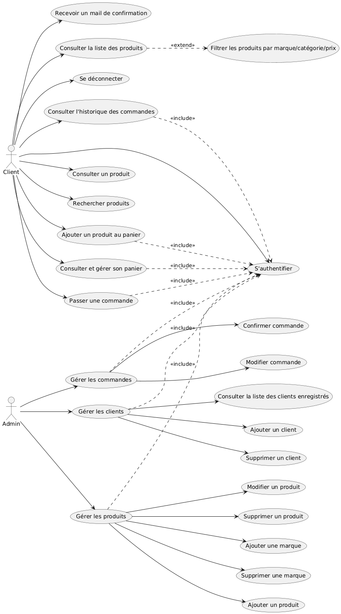

1. Présentation du projet :

- Auteurs : Eya Krida/ Shadha Mefteh
- Date : 04/04/2025
- Sujet : Site de e-commerce

1. Introduction au projet :

Développer un site web e-commerce permettant la vente de produits en ligne avec une interface utilisateur intuitive, un back-office de gestion et un système de paiement sécurisé.

1. Spécification du projet :

- Notions de base :
- **E-commerce (commerce électronique)**  
    Le site web aura pour vocation de vendre des produits physiques ou numériques via Internet. Il inclut un **catalogue de produits**, un **panier d’achat**, un **système de paiement**, ainsi qu’une **interface de gestion** pour l’administration du site.
- **Contraintes du projet :**
- Site adapté à tous types d’appareils (pc/ téléphone/ tablette)
- Intégration d’un système de paiement sécurisé
- Une bonne user experience ( une interface claire et intuitive)
- Gestion simple et efficace du back-office.
- Le projet devra être réalisé dans un délai
- Les acteurs :
- Client : Utilisateur qui peut consulter les produits du site, passer des commandes, consulter son historique, modifier son profil
- Administrateur : Responsable de la gestion du site ( gérer produits et utilisateurs)
- Les fonctionnalités attendues :
- Client :

\* Consulter les catégories et les marques des produits

\* Consulter tous les produits

\*Consulter un produit (voir son prix, description..)

\* Rechercher des produits spécifiques

\* Filtrer par prix, par catégorie, par marque

\* Ajouter un produit au panier

\* Passer une commande

\* Modifier la quantité d’un produit dans le panier

\* Supprimer un produit du panier

\* Création d’un compte ou se connecter à un compte existant

\* Consulter son historique commandes avec statut

\* Se déconnecter du site

\* Recevoir mail de confirmation

- Administrateur :

\* Connexion sécurisé à son compte

\* Ajouter / modifier / supprimer des produits

\* Gérer les informations liées aux produits (modifier/ ajouter/ supprimer)

\* Gestion des catégories/marques des produits (par exemple ajouter une marque)

\* Gestion des utilisateurs (voir la liste des clients inscrits, modifier ou supprimer un compte si besoin)

\* Gestion des commandes ( Suivre/ modifie commndes )

4\. Diagramme de cas d’utilisation

5\. Les Priorités des cas d’utilisation.

Pour le 1er sprint nous avons choisi pour l’administrateur : ajouter un produit au site et pour le client : Passer une commande

- Cas d’utilisation : ajouter produit au site

**Acteur principal** : Administrateur

**Préconditions**

L’administrateur est connecté au **back-office (interface d’administration)**. ∧

Il a les droits nécessaires pour gérer les produits. ∧

Infos du produit bien remplies ∧

Produit non existant dans la base

**Postconditions**

Le nouveau produit est visible sur le site e-commerce côté client. ∧

Il est listé dans l’espace "Gestion des produits" de l’admin. ∧

Les clients peuvent le consulter et l’ajouter à leur panier.

|     |     | 1   | 2   | 3   | 4   | 5   |
| --- | --- | --- | --- | --- | --- | --- |
| Préconditions | Administrateur connecté | F   | T   | T   | T   | T   |
|     | Administrateur possédant les droits |     | F   | T   | T   | T   |
|     | Produit non existant dans la base |     |     | F   | T   | T   |
|     | Infos du produit bien remplies |     |     |     | F   | T   |
| Postcondition | Ajout effectué | F   | F   | F   | F   | T   |
|     | Nombre de jeux de tests | 2   | 2   | 2\*n | 1   | 1   |

- Cas d’utilisation : Passer une commande

**Acteur principal** : Client

**Préconditions**

Le client est connecté au **back-office (interface client)**. ∧

Il a un panier non vide ∧

Le produit est disponible en stock avec la quantité désirée. ∧

Les informations de livraison sont spécifiées. ∧

Le client choisit un mode de paiement adéquat.

**Postconditions**

La commande est vérifiée par l’admin et confirmée. ∧

Le client recoit un mail de confirmation.

|     |     | 1   | 2   | 3   | 4   | 5   |
| --- | --- | --- | --- | --- | --- | --- |
| Préconditions | Client connecté | F   | T   | T   | T   | T   |
|     | Panier non vide |     | F   | T   | T   | T   |
|     | Quantité disponible en stock |     |     | F   | T   | T   |
|     | Informations de livraison fournies |     |     |     | F   | T   |
|     | Un mode de paiement choisi |     |     |     |     | T   |
| Postcondition | Recevoir un mail de confirmation | F   | F   | F   | F   | T   |
|     | Nombre de jeux de tests | 2   | 2   | 2\*n | 1   | 1   |
